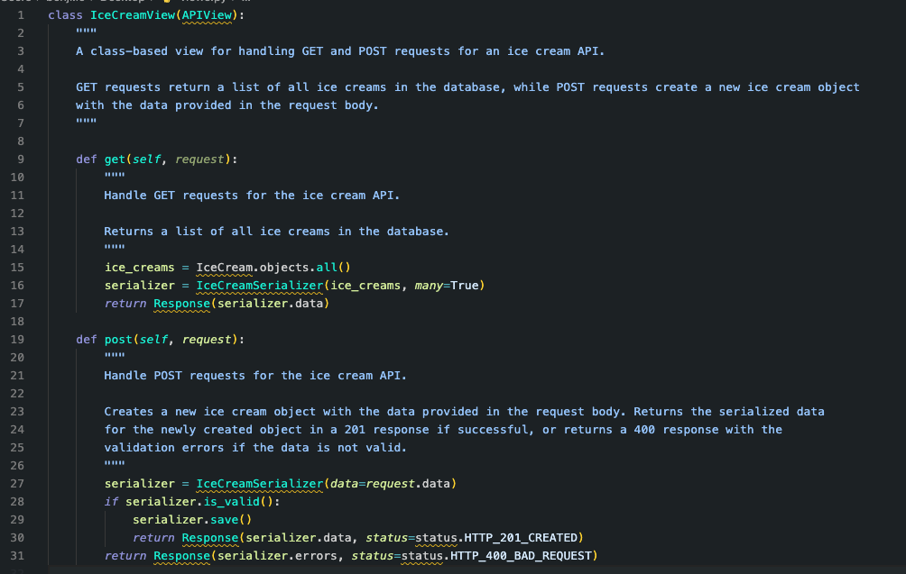

# Is them tears bro!?
Is them tears bro!? is a visually stunning and unique theme for Visual Studio Code that blends shades of blue and purple to create a calming and immersive coding experience.

### Features
* A soothing blend of blue and purple hues that is easy on the eyes.
* Careful selection of syntax colors to make your code stand out.
* Consistent theme design that extends to all the UI elements of Visual Studio Code.
* Designed for maximum productivity and reduced eye strain during long coding sessions.

### Installation
You can install Is them tears bro!? via the [Visual Studio Code Extension Marketplace](https://marketplace.visualstudio.com/items?itemName=benji011.isthemtearsbro).

1. Launch **Visual Studio Code**
2. Go to **Extensions** in the left-hand sidebar
3. Search for "Is them tears bro!"?
4. Click **Install**
5. Set the theme as your default in the **Settings** menu.

### Credits
"Is them tears bro!?" theme was inspired by a theme used by a coworker. I used an online theme builder to recreate and refine the design into a "beautiful" Visual Studio Code theme.
